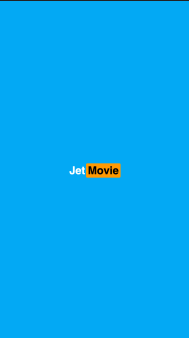
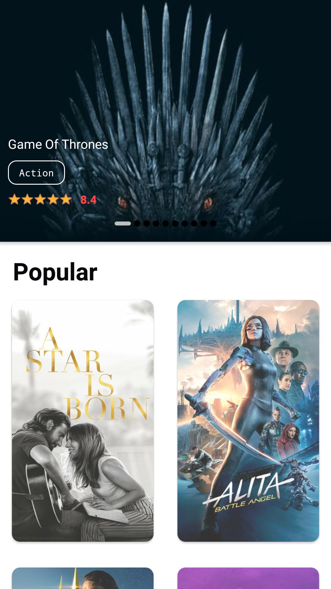
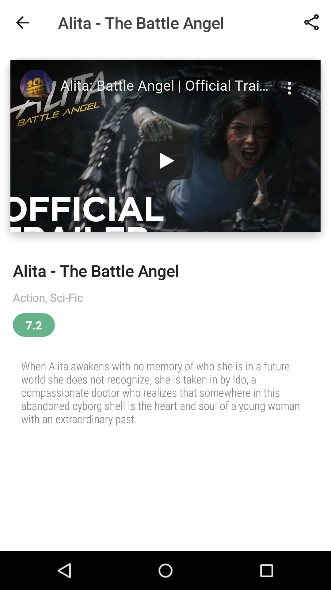

Introduction
============

**JetMovie** is my project name for Dicoding Academy in class *Belajar Android Jetpack Pro*,
build with Kotlin and implementing Clean Architecture.

Screenshot
==========

