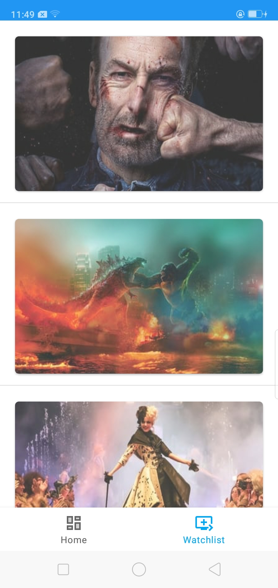
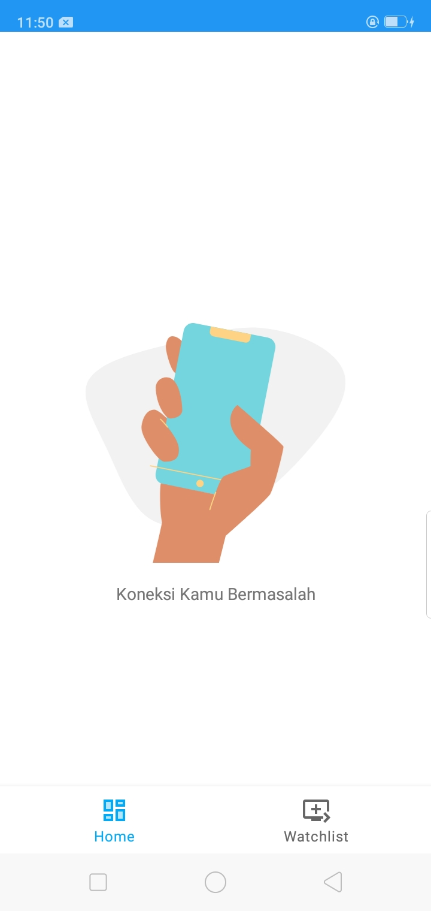
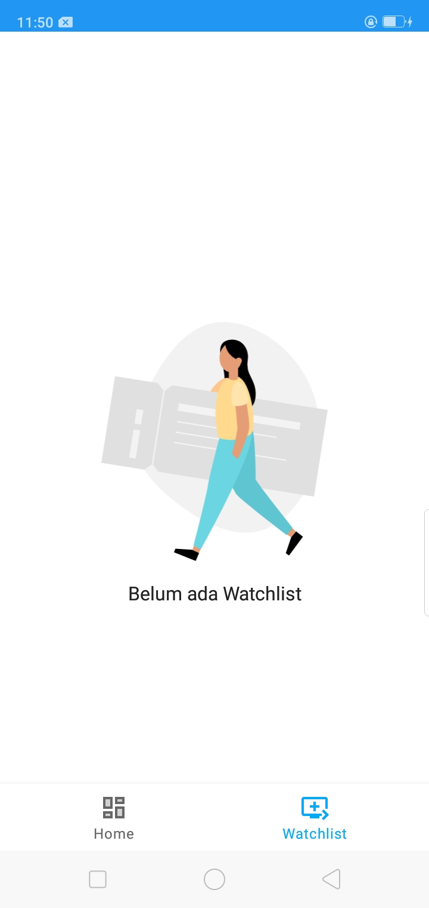
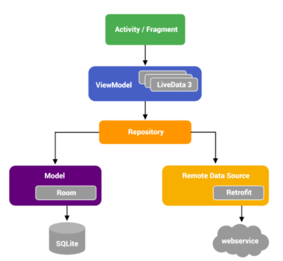

Introduction
============
**JetMovie** is my project name for Dicoding Academy in class *Belajar Android Jetpack Pro*,
build with Kotlin and implementing Clean Architecture.

**How To Run**
 - Create file *apikey.properties* in your root project
 - Initialize the secret key into your gradle file

Dependencies
------------
 - Material Design
 - Glide
 - Motion Layout
 - Retrofit
 - Shimmer Loading 
 - Mockito
 - Room Database
 - Lifecycle Arch
 [Check MAD Scorecard](https://madscorecard.withgoogle.com/scorecards/3512515570/)

Screenshot
==========
  
 
  

Architecture
============

